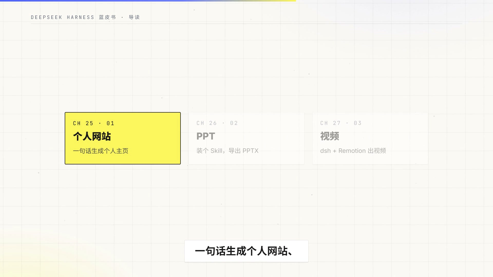

# 超级视频（super-video）

把一段写好的脚本，从零做成**配音、同步字幕、动画画面**齐备的成片视频。全程 AI 自动化，无需真人出镜，无需视频剪辑软件。

## 实操效果展示

用本技能从零生成的完整成片（1920×1080，含配音与同步字幕），点击封面观看：

[](https://yun.52013142.us.ci/file/github/super-video/1790744540839.mp4)

## 它能做什么

- 从文字稿一键生成完整成片（15 秒 ~ 3 分钟），配音、字幕、画面一次到位
- 中文旁白配音：MiniMax 整段合成，5 种实测音色可选；无密钥时可免费回退 Edge-TTS
- 整句同步字幕：时间轴从真实音频反推，字幕随场景整句切换，改稿重跑后音画依旧严格同步
- 动画画面完全可定制：布局、配色、动画、字体均由 HTML/CSS 控制
- 支持按需 BGM 合成与音量调校，内置自检管线确保成片质量
- 也可加工已有口播视频：加字幕、叠特效、换背景、混音

## 工作原理

核心原则一句话：**音频定时间，画面跟着音频走。**

```
script.txt（每行一句）
 ① minimax_narrate.py      MiniMax 整段合成配音        → narration.mp3 / .wav / _16k.wav
 ② transcribe_narration.py faster-whisper 词级转写     → narration_words.json
 ③ build_timeline.py       文案字符 ↔ 词级字符 强制对齐 → timeline.json（真实时间轴）
 ④ build_composition.py    数据驱动生成 HTML+GSAP 画面  → index.html
 ⑤ hyperframes render      渲染无声视觉版              → visual.mp4
 ⑥ merge_audio.py          FFmpeg 后置合成旁白(+BGM)   → final.mp4
 ⑦ verify_audio.py         音频时长/尾段验证           → PASS/FAIL
```

时间轴的唯一真源是**从真实音频反推的词级时间戳**，画面与字幕的全部时间由它生成——因此换音色、改稿重跑之后，音画永远同步。

## 环境要求

| 工具 | 说明 |
|------|------|
| Node.js 22+ | HyperFrames CLI 运行时 |
| FFmpeg 5.0+ | Windows: `winget install Gyan.FFmpeg`；macOS: `brew install ffmpeg`；Linux: `apt install ffmpeg` |
| Python 3.9+ | 运行技能脚本 |
| faster-whisper | `pip install faster-whisper`（本地词级转写） |
| MiniMax 密钥 | 环境变量 `MINIMAX_API_KEY`，或写入 `~/.config/minimax/api_key`（推荐，一次配置长期有效） |

## 快速开始

```bash
# ① 合成配音（默认少女音，--voice 可换音色）
python scripts/minimax_narrate.py script.txt -o narration

# ② 词级转写
python scripts/transcribe_narration.py narration_16k.wav -o narration_words.json

# ③ 强制对齐，生成真实时间轴
python scripts/build_timeline.py script.txt narration_words.json narration.wav -o timeline.json

# ④ 数据驱动生成画面（画面写在 scenes.json，参考 assets/scenes.example.json）
python scripts/build_composition.py timeline.json scenes.json -o index.html --theme assets/theme.css

# ⑤ 渲染（先草稿再成片）
npx hyperframes lint
npx hyperframes render --quality draft --output visual_draft.mp4 --quiet
npx hyperframes render --quality high  --output visual.mp4 --quiet

# ⑥ 合成音轨
python scripts/merge_audio.py visual.mp4 narration.wav -o final.mp4

# ⑦ 验证
python scripts/verify_audio.py final.mp4 --min-duration <total> --tail-seconds 12
```

换音色/换模型只需重跑 ①-④（改一个 `--voice` 或 `--model` 参数），画面文件不动，时间轴自动跟随新音频重算。

## 音色

| 音色 | voice_id |
|------|----------|
| 少女（默认） | `female-shaonv` |
| 青涩青年 | `male-qn-qingse` |
| 御姐 | `female-yujie` |
| 甜美 | `female-tianmei` |
| 新闻主播 | `Chinese (Mandarin)_News_Anchor` |

## 目录结构

```
super-video/
├── SKILL.md          # 技能主文件：工作流、硬约束、管线命令
├── scripts/          # 管线脚本（合成/转写/对齐/生成/混音/验证）
├── references/       # 深度参考文档（渲染、对齐原理、TTS、后期加工等）
└── assets/           # 音色配置、场景示例、主题样式
```

## 许可证

[MIT](LICENSE) © super-mortal

> 本项目部分灵感来源于 @zrzqbr
